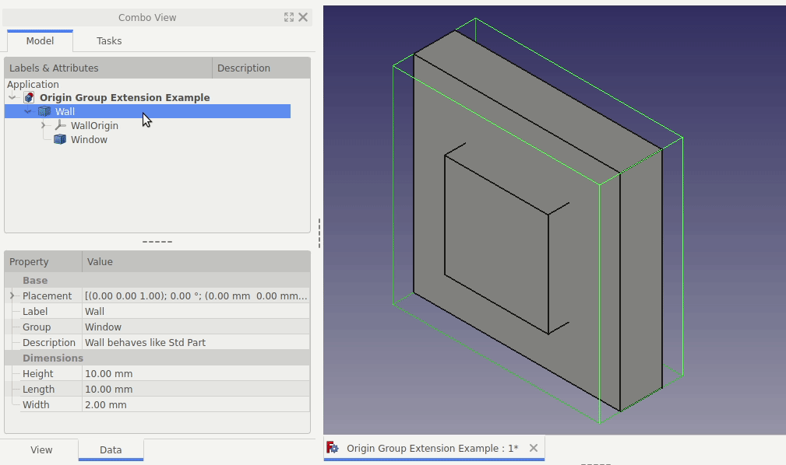

# FreeCAD Origin Group Extension Python Example
The purpose of this repository is to show a minimal example of the `App::OriginGroupExtensionPython` extension using [scripted objects](https://wiki.freecadweb.org/FeaturePython_Objects) in Python.

At a high-level, the `App::OriginGroupExtensionPython` extension allows scripted objects to have it's own shape, contain other objects, and move them as `App::Part` does (see also [Std Part](https://wiki.freecadweb.org/Std_Part)). For example, imagine a wall that contains it's own wall shape, but also the windows, and moves all of them accordingly.



Where [App::Part](https://wiki.freecadweb.org/Std_Part) objects only act as a container without any shape.

See [origin_group_extension_example.py](./origin_group_extension_example.py) for the full and complete example.

## Limitations
* Child objects don't respect GUI changes like toggling visibility with `SPACE` bar.
* Standard Undo behavior doesn't work when making changes to child object placement.

## References
* [FreeCAD Forum - [Solved] Python object with OriginGroupExtension](https://forum.freecadweb.org/viewtopic.php?f=22&t=44701)
* [FreeCAD Forum - Documenting Python Extensions](https://forum.freecadweb.org/viewtopic.php?f=22&t=47132)

## Tested With the Following FreeCAD Version
Tested with the following FreeCAD version information:

```
OS: Ubuntu 18.04.3 LTS (Unity/ubuntu)
Word size of OS: 64-bit
Word size of FreeCAD: 64-bit
Version: 0.19.20909 (Git)
Build type: Release
Branch: (HEAD detached at 0.19.alpha2)
Hash: 8be2c08141f0275e9da005bd143771953e982a59
Python version: 3.7.6
Qt version: 5.12.5
Coin version: 4.0.0
OCC version: 7.4.0
Locale: English/United States (en_US)
```
